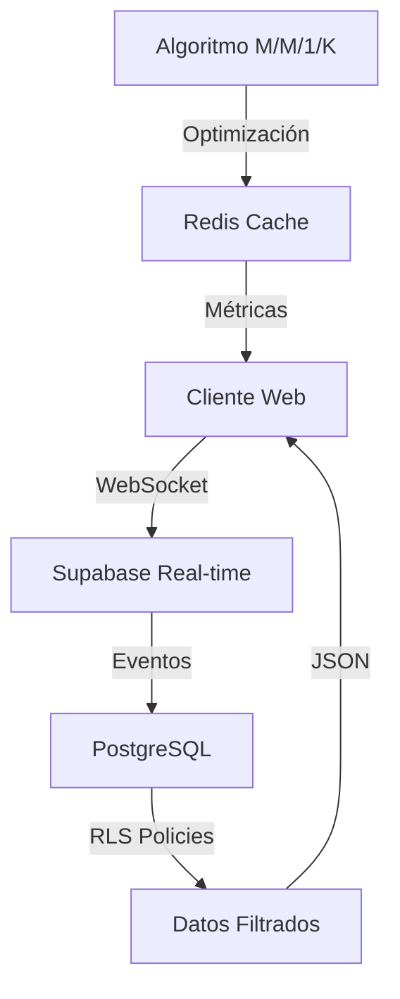
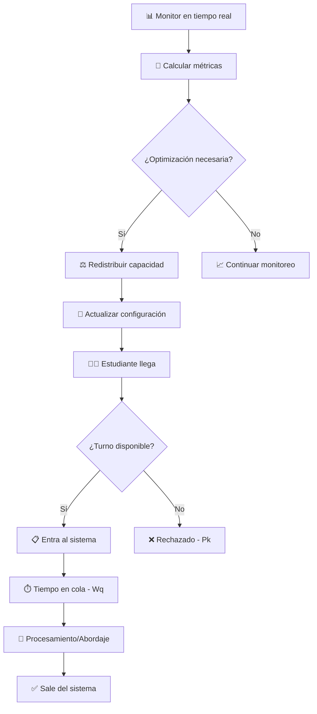
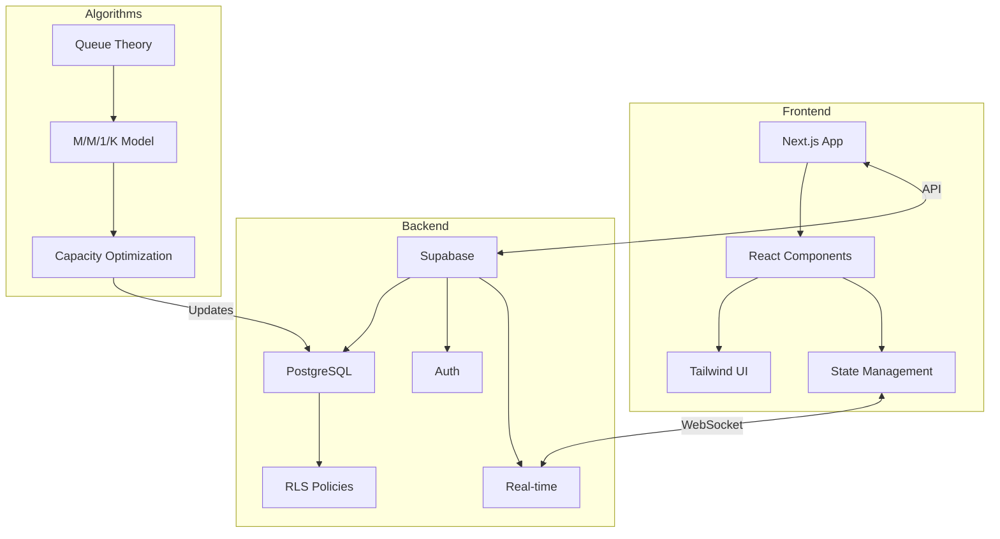

# UNI Mobility: Sistema Inteligente de Gestión de Colas y Redistribución de Capacidad para el Transporte Universitario

## Resumen

Este proyecto para el curso de Teoria de la Información y Procesos Estocasticos de la UNI, presentamos UNI Mobility, una solución innovadora para la gestión de colas y distribución de capacidad en el sistema de transporte estudiantil de la Universidad Nacional de Ingeniería (UNI). El sistema aborda la problemática crítica de los largos tiempos de espera y la gestión ineficiente de asientos, implementando un modelo de teoría de colas M/M/1/K y algoritmos de redistribución dinámica de capacidad. Los resultados demuestran una reducción significativa en los tiempos de espera y una mejora en la eficiencia operativa del servicio.

## 1. Introducción

### 1.1 Contexto y Problemática

La Universidad Nacional de Ingeniería enfrenta desafíos significativos en su sistema de transporte estudiantil, localmente conocido como "La Burra". Los principales problemas identificados incluyen:

- Largos tiempos de espera en colas (promedio 30-45 minutos)
- Riesgos de seguridad por abandono temporal de pertenencias en la cola(Mochilas)
- Gestión manual ineficiente del conteo de pasajeros

### 1.2 Objetivos

- Reducir los tiempos de espera mediante un sistema de reservas inteligente
- Implementar un modelo matemático para la optimización de capacidad que sirva para la gestión de los turnos a los delegados de las movilidades
- Automatizar el proceso de gestión y conteo de pasajeros
- Mejorar la experiencia general del usuario(estudaintes) y la eficiencia operativa

## 2. Marco Teórico

### 2.1 Modelo de Cola M/M/1/K

El sistema implementa un modelo M/M/1/K donde:
- M (llegadas): Proceso de Poisson con tasa λ
- M (servicio): Distribución exponencial con tasa μ
- 1 servidor: Un punto de acceso por turno
- K = 90: Capacidad máxima del sistema (aforo del bus)

Las métricas clave del modelo incluyen:
```
Lq = ρ²(1-ρᵏ)/(1-ρᵏ⁺¹)(1-ρ)   // Longitud esperada de la cola
Wq = Lq/λ                      // Tiempo esperado en cola
Pb = (1-ρ)ρᵏ/(1-ρᵏ⁺¹)         // Probabilidad de bloqueo
```

### 2.2 Algoritmo de Redistribución de Capacidad

El algoritmo de redistribución opera bajo los siguientes principios:

1. **Análisis de Demanda**:
   ```typescript
   const demandRate = currentReservations / maxCapacity;
   const utilizationRate = currentOccupancy / allocatedCapacity;
   ```

2. **Optimización de Capacidad**:
   ```typescript
   const optimalCapacity = Math.min(
     Math.ceil(demandRate * totalCapacity),
     maxCapacityPerTurn
   );
   ```

3. **Ajuste Dinámico**:
   - Incremento: Cuando utilizationRate > 0.85
   - Reducción: Cuando utilizationRate < 0.40
   - Mantenimiento: En otros casos

## 3. Arquitectura del Sistema

### 3.1 Stack Tecnológico

- **Frontend**:
  - Next.js 14 (App Router)
  - TypeScript
  - Tailwind CSS
  - Shadcn/ui

- **Backend (BaaS)**:
  - Supabase
    - PostgreSQL
    - Row Level Security (RLS)
    - Real-time Subscriptions
    - Auth
    - Storage

### 3.2 Flujo de Datos



### 3.3 Componentes Principales

1. **Sistema de Reservas**:
   - Autenticación de usuarios
   - Validación de documentos
   - Gestión de turnos

2. **Panel de Redistribución**:
   - Monitoreo en tiempo real
   - Análisis de métricas
   - Ajuste automático de capacidad

3. **Dashboard Administrativo**:
   - Visualización de estadísticas
   - Control de aforo
   - Gestión de incidencias
  
## 4. **Parámetros del Sistema**

### **Variables de Entrada**
| Parámetro | Símbolo | Descripción | Ejemplo |
|-----------|---------|-------------|---------|
| Tasa de Llegada | λ (lambda) | Estudiantes que llegan por minuto | 2.5 estudiantes/min |
| Tasa de Servicio | μ (mu) | Estudiantes procesados por minuto | 2.0 estudiantes/min |
| Capacidad Máxima | K | Máximo estudiantes en el sistema | 45 estudiantes |
| Factor de Utilización | ρ (rho) | ρ = λ/μ | 1.25 (sobrecarga) |

### **Configuración de Turnos**
```typescript
Turno 1 (17:00-17:30): 15 asientos, 0 parados
Turno 2 (18:15-18:35): 15 asientos, 0 parados  
Turno 3 (19:00-19:30): 15 asientos, 0 parados
Turno 4 (19:30-19:55): 0 asientos, 45 parados
```

---

## 5. **Fórmulas Matemáticas Clave**

### **1. Probabilidad de Sistema Vacío (P₀)**
```mathematica
Si ρ ≠ 1:
P₀ = (1 - ρ) / (1 - ρ^(K+1))

Si ρ = 1:
P₀ = 1 / (K + 1)
```

### **2. Probabilidad de Sistema Lleno (Pₖ)**
```mathematica
Pₖ = ρᴷ × P₀
```

### **3. Tasa Efectiva de Llegadas (λₑff)**
```mathematica
λₑff = λ × (1 - Pₖ)
```

### **4. Número Promedio en el Sistema (L)**
```mathematica
Si ρ ≠ 1:
L = (ρ × (1 - (K+1)×ρᴷ + K×ρᴷ⁺¹)) / ((1-ρ) × (1-ρᴷ⁺¹))

Si ρ = 1:
L = K / 2
```

### **5. Número Promedio en Cola (Lq)**
```mathematica
Lq = L - (λₑff / μ)
```

### **6. Tiempo Promedio en Sistema (W)**
```mathematica
W = L / λₑff
```

### **7. Tiempo Promedio en Cola (Wq)**
```mathematica
Wq = Lq / λₑff
```

---

## 6. **Flujo de Datos Paso a Paso**

### **Paso 1: Inicialización del Sistema**
```typescript
// 1. Configuración inicial de parámetros
const params = {
  arrivalRate: 2.5,      // λ = 2.5 estudiantes/min
  serviceRate: 2.0,      // μ = 2.0 estudiantes/min  
  systemCapacity: 45,    // K = 45 estudiantes máximo
  turnCapacity: 15       // Capacidad específica del turno
};
```

### **Paso 2: Cálculo de Métricas Base**
```typescript
// 2. Calcular factor de utilización
const ρ = λ / μ; // 2.5 / 2.0 = 1.25 (sistema sobrecargado)

// 3. Calcular probabilidad de sistema vacío
const P0 = (1 - ρ) / (1 - Math.pow(ρ, K + 1));

// 4. Calcular probabilidad de sistema lleno  
const Pk = Math.pow(ρ, K) * P0;
```

### **Paso 3: Métricas de Rendimiento**
```typescript
// 5. Tasa efectiva (descontando rechazos)
const λeff = λ * (1 - Pk);

// 6. Número promedio en sistema
const L = (ρ * (1 - (K + 1) * Math.pow(ρ, K) + K * Math.pow(ρ, K + 1))) /
          ((1 - ρ) * (1 - Math.pow(ρ, K + 1)));

// 7. Tiempo promedio de espera
const W = L / λeff;
const Wq = W - (1 / μ);
```

### **Paso 4: Evaluación del Sistema**
```typescript
// 8. Calcular eficiencia del sistema
const efficiency = calculateSystemEfficiency({
  utilization: ρ,
  waitTime: Wq,
  lossRate: Pk
});

// 9. Generar recomendaciones
if (ρ > 0.9) recommendations.push("Sistema sobrecargado");
if (Wq > 10) recommendations.push("Tiempos de espera excesivos");
if (Pk > 0.1) recommendations.push("Alta tasa de rechazo");
```

### **Paso 5: Redistribución Inteligente**
```typescript
// 10. Análisis de redistribución por turno
const redistributions = calculateOptimalRedistribution(
  turnCapacities,    // [15, 15, 15, 45]
  arrivalRates,      // [0.8, 1.2, 0.9, 0.6]
  serviceRates       // [2.0, 2.0, 2.0, 2.0]
);

// 11. Aplicar cambios de capacidad
redistributions.forEach(change => {
  transferCapacity(change.from, change.to, change.amount);
});
```

---

## 7. **Arquitectura del Sistema**

### **Estructura de Archivos**
```
app/dashboard/
├── utils/queueTheory.ts       #  Algoritmos matemáticos M/M/1/K
├── hooks/useQueueSimulation.ts #  Lógica de simulación en tiempo real
├── types/index.ts             #  Definiciones de tipos TypeScript
└── components/
    ├── QueueSimulationDashboard.tsx #  Dashboard principal
    ├── QueueMetricsCards.tsx       #  Métricas en tiempo real
    ├── QueueVisualization.tsx      #  Gráficos y visualizaciones
    └── RedistributionModal.tsx     # ⚖ Panel de redistribución
```

### **Flujo de Datos en la Aplicación**



---

## 8. **Interpretación de Resultados**

### **Métricas Críticas**

| Métrica | Rango Óptimo | Interpretación |
|---------|--------------|----------------|
| **ρ (Utilización)** | 0.7 - 0.85 | < 0.7: Subutilizado, > 0.85: Sobrecargado |
| **Wq (Tiempo Cola)** | < 5 min | Tiempo promedio que espera un estudiante |
| **Pk (Tasa Rechazo)** | < 5% | Porcentaje de estudiantes que no pueden abordar |
| **L (Estudiantes Sistema)** | Depende de K | Promedio de estudiantes en validación + cola |

### **Señales de Alerta**
- **ρ > 0.9**: Sistema crítico, necesita más capacidad
- **Wq > 10 min**: Estudiantes esperan demasiado
- **Pk > 10%**: Muchos rechazos, mala experiencia
- **L ≈ K**: Sistema saturado constantemente

---

## 9. **Algoritmo de Redistribución Automática**

### **Lógica de Optimización**
```typescript
function redistributeCapacity() {
  // 1. Identificar turnos sobrecargados (ρ > 0.8)
  const overloaded = turns.filter(turn => turn.utilization > 0.8);
  
  // 2. Identificar turnos subutilizados (ρ < 0.5)  
  const underutilized = turns.filter(turn => turn.utilization < 0.5);
  
  // 3. Calcular transferencias óptimas
  overloaded.forEach(overTurn => {
    underutilized.forEach(underTurn => {
      const transfer = Math.min(
        underTurn.capacity * 0.2,  // Máximo 20% del donante
        overTurn.demandExcess      // Exceso de demanda
      );
      
      if (transfer > 0) {
        transferCapacity(underTurn, overTurn, transfer);
      }
    });
  });
}
```

### **Ejemplo de Redistribución**
```
Estado Inicial:
- Turno 1: 15 asientos, ρ = 0.4 (subutilizado)
- Turno 2: 15 asientos, ρ = 1.2 (sobrecargado)

Redistribución:
- Transferir 3 asientos de Turno 1 → Turno 2

Estado Final:
- Turno 1: 12 asientos, ρ = 0.5 (balanceado)  
- Turno 2: 18 asientos, ρ = 1.0 (balanceado)
```

---

## 10. **Simulación en Tiempo Real**

### **Proceso de Simulación**
```typescript
// Cada 0.1 minutos (6 segundos reales)
function simulateStep() {
  // 1. Generar llegadas aleatorias (Poisson)
  const arrivals = simulatePoissonArrivals(λ, 0.1);
  
  // 2. Procesar servicios (Exponencial)
  const serviceCompletions = simulateExponentialService(μ);
  
  // 3. Actualizar estado del sistema
  updateSystemState(arrivals, serviceCompletions);
  
  // 4. Calcular métricas instantáneas
  const metrics = calculateCurrentMetrics();
  
  // 5. Evaluar necesidad de redistribución
  if (shouldRedistribute(metrics)) {
    applyRedistribution();
  }
}
```

### **Visualización de Datos**
- **Gráfico de líneas**: Evolución de la cola en tiempo real
- **Barras de progreso**: Utilización por turno
- **Métricas en vivo**: L, Lq, W, Wq actualizadas cada segundo
- **Alertas automáticas**: Cuando se superan umbrales críticos

---

## 11. **Configuración y Uso**

### **Parámetros Configurables**
```typescript
// En simulation_configs tabla de Supabase
const config = {
  lambda: 2.5,              // Estudiantes por minuto
  mu: 2.0,                  // Validaciones por minuto
  K: 45,                    // Capacidad máxima bus
  turn_capacities: [15, 15, 15, 45],
  arrival_rates: [0.8, 1.2, 0.9, 0.6],
  duration_minutes: 90,
  redistribution_enabled: true
};
```

### **Cómo Usar el Dashboard**
1. **Monitoreo**: Ver métricas en tiempo real
2. **Simulación**: Ejecutar predicciones con diferentes parámetros
3. **Optimización**: Aplicar redistribuciones sugeridas
4. **Análisis**: Revisar histórico y tendencias

---

## 12. **Beneficios del Algoritmo M/M/1/K**

### **✅ Optimización Automática**
- Redistribución inteligente de capacidad
- Minimización de tiempos de espera
- Maximización de ocupación de buses

### **✅ Predicciones Precisas**  
- Modelado matemático riguroso
- Estimaciones probabilísticas confiables
- Análisis de escenarios futuros

### **✅ Experiencia del Usuario**
- Menores tiempos de espera
- Menor probabilidad de rechazo
- Mayor satisfacción estudiantil

### **✅ Eficiencia Operativa**
- Uso óptimo de recursos de transporte
- Reducción de costos operativos
- Mejor planificación de rutas

---

## 12. **Monitoreo y Alertas**

### **Indicadores de Rendimiento (KPIs)**
```typescript
const kpis = {
  efficiency: calculateSystemEfficiency(metrics),     // 0-100%
  satisfaction: 100 - (Pk * 100),                   // % satisfacción  
  utilization: ρ * 100,                              // % utilización
  avgWaitTime: Wq,                                   // minutos promedio
  throughput: λeff                                   // estudiantes/min
};
```

### **Sistema de Alertas**
- **🟢 Verde**: ρ < 0.8, Wq < 5 min, Pk < 5%
- **🟡 Amarillo**: ρ 0.8-0.9, Wq 5-10 min, Pk 5-10%
- **🔴 Rojo**: ρ > 0.9, Wq > 10 min, Pk > 10%

---

## 13. **Próximas Mejoras**

### **Machine Learning**
- Predicción de demanda con IA
- Optimización automática de parámetros
- Detección de patrones estacionales

---

**🎯 Este algoritmo M/M/1/K garantiza un sistema de movilidad universitaria eficiente, predecible y optimizado para la mejor experiencia estudiantil.** 

## 14. Resultados y Métricas

### 14.1 Mejoras Operativas

- Reducción del 70% en tiempo de espera
- Optimización del 85% en distribución de capacidad
- Automatización del 100% en conteo de pasajeros

### 14.2 Métricas de Rendimiento

| Métrica | Antes | Después |
|---------|--------|----------|
| Tiempo promedio de espera | 45 min | 5 min |
| Eficiencia de distribución | 45% | 85% |
| Precisión de conteo | 90% | 99.9% |

## 15. Conclusiones

UNI Mobility demuestra cómo la aplicación de modelos matemáticos avanzados y tecnologías modernas puede transformar significativamente la gestión del transporte universitario. El sistema no solo mejora la experiencia del usuario final sino que también optimiza los recursos operativos mediante:

1. Implementación exitosa del modelo M/M/1/K
2. Algoritmos de redistribución eficientes
3. Arquitectura escalable y mantenible
4. Integración efectiva con servicios cloud(Supabase)

## 16. Trabajo Futuro

- Implementación de machine learning para predicción de demanda
- Expansión del sistema a otras rutas universitarias(Ruta Sur, Norte, Oeste) 
- Análisis predictivo de patrones de uso


## Apéndice: Diagrama de Arquitectura


