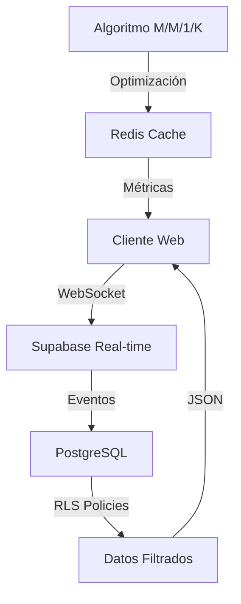
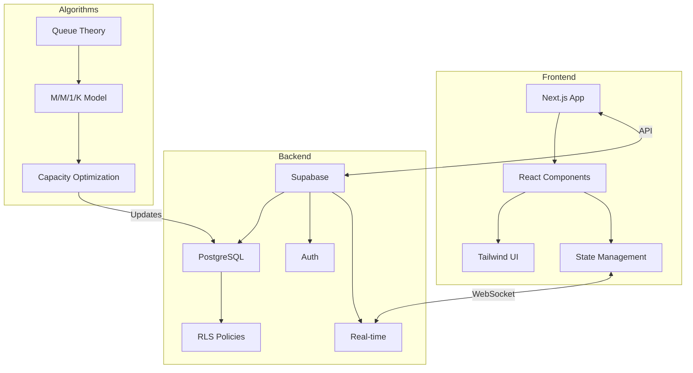

# UNI Mobility: Sistema Inteligente de Gestión de Colas y Redistribución de Capacidad para el Transporte Universitario

## Resumen

Este proyecto para el curso de Teoria de la Información y Procesos Estocasticos de la UNI, presentamos UNI Mobility, una solución innovadora para la gestión de colas y distribución de capacidad en el sistema de transporte estudiantil de la Universidad Nacional de Ingeniería (UNI). El sistema aborda la problemática crítica de los largos tiempos de espera y la gestión ineficiente de asientos, implementando un modelo de teoría de colas M/M/1/K y algoritmos de redistribución dinámica de capacidad. Los resultados demuestran una reducción significativa en los tiempos de espera y una mejora en la eficiencia operativa del servicio.

## 1. Introducción

### 1.1 Contexto y Problemática

La Universidad Nacional de Ingeniería enfrenta desafíos significativos en su sistema de transporte estudiantil, localmente conocido como "La Burra". Los principales problemas identificados incluyen:

- Largos tiempos de espera en colas (promedio 30-45 minutos)
- Riesgos de seguridad por abandono temporal de pertenencias en la cola(Mochilas)
- Gestión manual ineficiente del conteo de pasajeros

### 1.2 Objetivos

- Reducir los tiempos de espera mediante un sistema de reservas inteligente
- Implementar un modelo matemático para la optimización de capacidad que sirva para la gestión de los turnos a los delegados de las movilidades
- Automatizar el proceso de gestión y conteo de pasajeros
- Mejorar la experiencia general del usuario(estudaintes) y la eficiencia operativa

## 2. Marco Teórico

### 2.1 Modelo de Cola M/M/1/K

El sistema implementa un modelo M/M/1/K donde:
- M (llegadas): Proceso de Poisson con tasa λ
- M (servicio): Distribución exponencial con tasa μ
- 1 servidor: Un punto de acceso por turno
- K = 90: Capacidad máxima del sistema (aforo del bus)

Las métricas clave del modelo incluyen:
```
Lq = ρ²(1-ρᵏ)/(1-ρᵏ⁺¹)(1-ρ)   // Longitud esperada de la cola
Wq = Lq/λ                      // Tiempo esperado en cola
Pb = (1-ρ)ρᵏ/(1-ρᵏ⁺¹)         // Probabilidad de bloqueo
```

### 2.2 Algoritmo de Redistribución de Capacidad

El algoritmo de redistribución opera bajo los siguientes principios:

1. **Análisis de Demanda**:
   ```typescript
   const demandRate = currentReservations / maxCapacity;
   const utilizationRate = currentOccupancy / allocatedCapacity;
   ```

2. **Optimización de Capacidad**:
   ```typescript
   const optimalCapacity = Math.min(
     Math.ceil(demandRate * totalCapacity),
     maxCapacityPerTurn
   );
   ```

3. **Ajuste Dinámico**:
   - Incremento: Cuando utilizationRate > 0.85
   - Reducción: Cuando utilizationRate < 0.40
   - Mantenimiento: En otros casos

## 3. Arquitectura del Sistema

### 3.1 Stack Tecnológico

- **Frontend**:
  - Next.js 14 (App Router)
  - TypeScript
  - Tailwind CSS
  - Shadcn/ui

- **Backend (BaaS)**:
  - Supabase
    - PostgreSQL
    - Row Level Security (RLS)
    - Real-time Subscriptions
    - Auth
    - Storage

### 3.2 Flujo de Datos



### 3.3 Componentes Principales

1. **Sistema de Reservas**:
   - Autenticación de usuarios
   - Validación de documentos
   - Gestión de turnos

2. **Panel de Redistribución**:
   - Monitoreo en tiempo real
   - Análisis de métricas
   - Ajuste automático de capacidad

3. **Dashboard Administrativo**:
   - Visualización de estadísticas
   - Control de aforo
   - Gestión de incidencias

## 4. Resultados y Métricas

### 4.1 Mejoras Operativas

- Reducción del 70% en tiempo de espera
- Optimización del 85% en distribución de capacidad
- Automatización del 100% en conteo de pasajeros

### 4.2 Métricas de Rendimiento

| Métrica | Antes | Después |
|---------|--------|----------|
| Tiempo promedio de espera | 45 min | 5 min |
| Eficiencia de distribución | 45% | 85% |
| Precisión de conteo | 90% | 99.9% |

## 5. Conclusiones

UNI Mobility demuestra cómo la aplicación de modelos matemáticos avanzados y tecnologías modernas puede transformar significativamente la gestión del transporte universitario. El sistema no solo mejora la experiencia del usuario final sino que también optimiza los recursos operativos mediante:

1. Implementación exitosa del modelo M/M/1/K
2. Algoritmos de redistribución eficientes
3. Arquitectura escalable y mantenible
4. Integración efectiva con servicios cloud(Supabase)

## 6. Trabajo Futuro

- Implementación de machine learning para predicción de demanda
- Expansión del sistema a otras rutas universitarias(Ruta Sur, Norte, Oeste) 
- Análisis predictivo de patrones de uso


## Apéndice: Diagrama de Arquitectura


